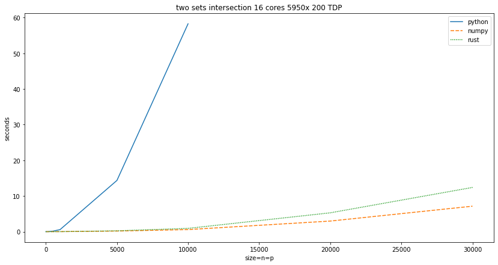

```bash
$ python -m venv venv  
$ source venv/bin/activate  
$ pip install -r requirements.txt  
$ maturin develop --release  
$ python main.py
$ python main.py -n 30 -p 10 --seed 42  --engine rust  
```

<p align="center">
  
</p>

*memory usage is quadratic in numpy and linear in rust*  
todo benchmark multithreaded rust
